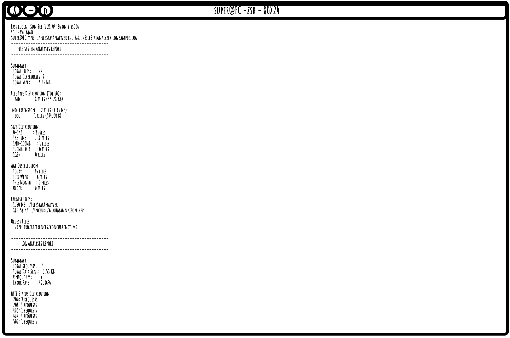

# File System & Log Analyzer

_Read this in other languages:_
[_አማርኛ_](README.am-AM.md) [_English_](README.md)



## Overview 
A high-performance C++20 tool designed to provide visibility into system health. It scans directory trees to map storage distribution and parses complex log files to detect traffic patterns and error spikes.


## Prerequisites
### C++ Compiler
- Requires a compiler supporting **C++20** (e.g., Clang 15+, GCC 11+).
### Dependencies
- **nlohmann/json**: Used for JSON report generation (automatically included).

## Installation
### 1. Clone the repository
```bash
git clone "https://github.com/ElrohiFilmon/File-Stat-Analyzer"
cd file_statistics_analyzer
```

### 2. Manual Compilation
If `cmake` is not available, use the provided compilation command:
```bash
clang++ -std=c++20 -Iinclude src/*.cpp -o FileStatAnalyzer
```

## Running the Application
### File System Analysis
Recursively scan a directory and show storage distribution.
```bash
./FileStatAnalyzer fs /path/to/directory
```

### Log Analysis
Parse an Apache, Nginx, or JSON log file.
```bash
./FileStatAnalyzer log /path/to/logfile.log
```

### JSON Output
Append `--json` to any command for structured output.
```bash
./FileStatAnalyzer fs . --json
```

## Code Structure
1. **FileSystemAnalyzer**
   - Recursive directory traversal using `std::filesystem`.
   - Aggregates file extensions, size histograms, and lists the largest files.
2. **LogAnalyzer**
   - Regex-based parsing for Apache Common/Combined formats.
   - Native support for JSON-structured logs.
   - Calculates error rates and summarizes top IP addresses/endpoints.
3. **ReportGenerator**
   - **TextReport**: Formats data into a clean, human-readable terminal output.
   - **JsonReport**: Generates serializable JSON for integration with other tools.

## Limitations and Improvements
1. **Date Filtering**: Currently relies on last-modified timestamps for FS; log time filtering is pending optimization.
2. **Depth Limit**: Recursion depth is configurable in code but not yet exposed via CLI flag.

## FAQs
**Q**: Can it handle files larger than 4GB?
**A**: Yes, the tool uses 64-bit integers (`uint64_t`) to support files of any size.

**Q**: Does it follow symbolic links?
**A**: By default, it ignores symbolic links to prevent infinite loops, but this is configurable.

## Future Enhancements
1. **Visualization**: Adding a Treemap generator for visual disk usage.
2. **Real-time Tail**: Monitoring log files in real-time as they are written.
3. **MIME-type Detection**: Looking inside files to determine types beyond extensions.

## References
- [cppreference - filesystem](https://en.cppreference.com/w/cpp/filesystem)
- [nlohmann/json Documentation](https://json.nlohmann.me/)
- [Modern C++ Best Practices](https://github.com/lefticus/cppbestpractices)
